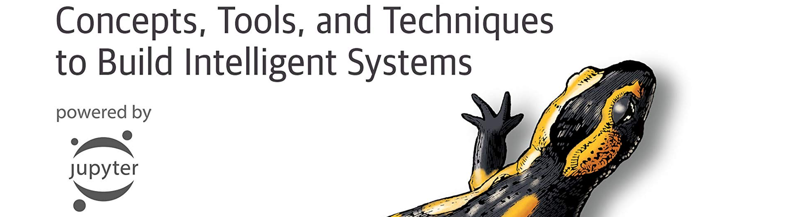

# Hands-on ML with Scikit-Learn, Keras & TF by Aurelien Geron

This repo is home to notes & code that accompanies Part 1 of Aurelien Geron's "Hands-on ML with Scikit-Learn, Keras & TF" book. The book provides a comprehensive overview of data science, machine learning (with `scikit-learn`), and deep learning (with `tensorflow`).

The Book assumes you know close to nothing about machine learning. It uses production-ready Python frameworks such as:
- `Scikit-Learn`
- `Keras`
- `TensorFlow`

The author favors a hands-on approach through a series of working examples and just a little bit of theory. Prerequesites:
- Some Python programming experience
- Familiarity with NumPy, Pandas, and Matplotlib
- A reasonable understanding of college-level math (calculus, probability, Linear Algebra, and statistics)

The first part of the book is mostly based on `Scikit-Learn`, while the 2nd part is using `Keras/TensorFlow`.

## Roadmap

### The Fundamentals of Machine Learning

We provide links for the available notebooks:
- [The Machine Learning Landscape](https://nbviewer.jupyter.org/github/Akramz/Hands-on-Machine-Learning-with-Scikit-Learn-Keras-and-TensorFlow/blob/master/01.ML_Landscape.ipynb)
- [End-to-End Machine Learning Project](https://nbviewer.jupyter.org/github/Akramz/Hands-on-Machine-Learning-with-Scikit-Learn-Keras-and-TensorFlow/blob/master/02.End-to-End-ML-Project.ipynb)
- [Classification](https://nbviewer.jupyter.org/github/Akramz/Hands-on-Machine-Learning-with-Scikit-Learn-Keras-and-TensorFlow/blob/master/03.Classification.ipynb)
- [Training Models](https://nbviewer.jupyter.org/github/Akramz/Hands-on-Machine-Learning-with-Scikit-Learn-Keras-and-TensorFlow/blob/master/04.Training-Models.ipynb)
- [Support Vector Machines](https://nbviewer.jupyter.org/github/Akramz/Hands-on-Machine-Learning-with-Scikit-Learn-Keras-and-TensorFlow/blob/master/05.SVMs.ipynb)
- [Decision Trees](https://nbviewer.jupyter.org/github/Akramz/Hands-on-Machine-Learning-with-Scikit-Learn-Keras-and-TensorFlow/blob/master/06.Decision_Trees.ipynb)
- [Ensemble Learning and Random Forests](https://nbviewer.jupyter.org/github/Akramz/Hands-on-Machine-Learning-with-Scikit-Learn-Keras-and-TensorFlow/blob/master/07.Ensembles_RFs.ipynb)
- [Dimensionality Reduction](https://nbviewer.jupyter.org/github/Akramz/Hands-on-Machine-Learning-with-Scikit-Learn-Keras-and-TensorFlow/blob/master/08.Dim_Reduction.ipynb)
- [Unsupervised Learning Techniques](https://nbviewer.jupyter.org/github/Akramz/Hands-on-Machine-Learning-with-Scikit-Learn-Keras-and-TensorFlow/blob/master/09.Unsupervised_learning.ipynb)

---
